## 1. 相机原理
配过眼镜的同学应该都被推销过非球面镜， 这种非球面镜相对于球面镜的好处是有很少的视觉扭曲。相机的镜头原理类似， 一般是由一块凸透镜组成， 凸透镜能够将实物影像从一侧映射到感光元件上形成实像。  相机由于其原理简单， 技术成熟价格便宜， 已经成为机器人感知最重要的一环。 然而这种显著的扭曲必须要在导航或者采集图像时进行修正。幸运的是，
我们能够通过一些校准手段对相机的参数进行修正， 校准。此外，通过校准，您还可以确定相机的自然单位（像素）与实际单位之间的关系（例如毫米）

## 2. 相机模型和内，外参

### 2.1 世界坐标系转换为相机坐标系
$$
\left[\begin{matrix}
x_c \\
y_c \\
z_c \\
1
\end{matrix} \right] = \left[ \begin{matrix}
\mathbf{R} & \mathbf{t} \\
0 & 1
\end{matrix} \right]  \left[ \begin{matrix}
x_w \\
y_w \\
z_w \\
1
\end{matrix} \right]$$

其中R为3\*3的旋转矩阵，t为3*1的平移矢量，$(x_{c},y_{c},z_{c},1)^{T}$为相机坐标系的齐次坐标，$(x_{w},y_{w},z_{w},1)^{T}$为世界坐标系的齐次坐标。

### 2.1 相机模型
根据相机成像模型知

现实世界的空间点 P，经过小孔 O 投影之后，落在物理成像平面 O′ − x′ − y′ 上，成
像点为 P ′。设 P 的坐标为 [X; Y; Z]T， P ′ 为 [X′; Y ′; Z′]T，并且设物理成像平面到小孔的距离为 f（焦距）。那么，根据三角形相似关系

$$X_{′} = f \frac{X}{Z}$$

$$Y_{′} = f \frac{Y}{Z}$$

  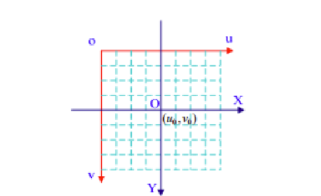

像素坐标系（pixel coordinate）:
像素坐标系‹通常的定义方式是：原点 o′ 位于图像的左上角， u 轴向右与 x 轴平行， v
轴向下与 y 轴平行。像素坐标系与成像平面之间，相差了一个缩放和一个原点的平移。我
们设像素坐标在 u 轴上缩放了 α 倍，在 v 上缩放了 β 倍。同时，原点平移了 [cx; cy]T。那么， P ′ 的坐标与像素坐标 [u; v]T 的关系为：

$$u = \alpha X_{'} + c_{x}$$

$$v = \beta Y_{'} + c_{y}$$

像素坐标系不利于坐标变换，因此需要建立图像坐标系XOY
，其坐标轴的单位通常为毫米（mm），原点是相机光轴与相面的交点（称为主点），即图像的中心点，X轴、Y轴分别与u轴、v轴平行。故两个坐标系实际是平移关系，即可以通过平移就可得到

- 图像坐标系转换为像素坐标系
  
$$
\left[\begin{matrix}
u \\
v \\
1
\end{matrix} \right] = 
\left[ \begin{matrix}
1/dX & 0 & u_0 \\
0 & 1/dY & v_0 \\
0 & 0 & 1
\end{matrix} \right]  
\left[ \begin{matrix}
X \\
Y \\
1
\end{matrix} \right]$$

其中，dX、dY分别为像素在X、Y轴方向上的物理尺寸，u0,v0为主点（图像原点）坐标。

 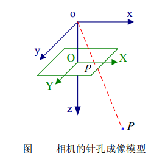

如图，空间任意一点P与其图像点p之间的关系，P与相机光心o的连线为oP，oP与像面的交点p即为空间点P在图像平面上的投影。
该过程为透视投影，如下矩阵表示：

- 世界坐标系转换为像素坐标系
  
$$
s \left[\begin{matrix}
X \\
Y \\
1
\end{matrix} \right] = \left[ \begin{matrix}
f & 0 & 0 & 0 \\
0 & f & 0 & 0 \\
0 & 0 & 1 & 0 
\end{matrix} \right]  \left[ \begin{matrix}
x \\
y \\
z \\
1
\end{matrix} \right]$$

其中，s为比例因子（s不为0），f为有效焦距（光心到图像平面的距离），(x,y,z,1)T是空间点P在相机坐标系oxyz中的齐次坐标，(X,Y,1)T是像点p在图像坐标系OXY中的齐次坐标。

$$s \left[\begin{matrix}
u \\
v \\
1
\end{matrix} \right] = \left[ \begin{matrix}
1/dX & 0 & u_0 \\
0 & 1/dY & v_0 \\
0 & 0 & 1
\end{matrix} \right] \left[ \begin{matrix}
f & 0 & 0 & 0 \\
0 & f & 0 & 0 \\
0 & 0 & 1 & 0 
\end{matrix} \right]  
\left[ \begin{matrix}
\mathbf{R} & \mathbf{t} \\
0 & 1
\end{matrix} \right]
\left[ \begin{matrix}
x_w \\
y_w \\
z_w \\
1
\end{matrix} \right] \\
= \left[ \begin{matrix}
\alpha_x & 0 & u_0 & 0 \\
0 & \alpha_y & v_0 & 0 \\
0 & 0 & 1 & 0 
\end{matrix} \right]  
\left[ \begin{matrix}
\mathbf{R} & \mathbf{t} \\
0 & 1
\end{matrix} \right]
\left[ \begin{matrix}
x_w \\
y_w \\
z_w \\
1
\end{matrix} \right] = \mathbf{M}_1 \mathbf{M}_2 \mathbf{X}_w = \mathbf{MX}_w
$$

其中，αx=f/dX、αy=f/dY，称为u、v轴的尺度因子，M1称为相机的内部参数矩阵，M2称为相机的外部参数矩阵，M称为投影矩阵。

### 2.4 畸变
为了获得好的成像效果，我们在相机的前方加了透镜。透镜的加入对成像过程中光线的传播会产生新的影响: 一是透镜自身的形状对光线传播的影响，二是在机械组装过程中，透镜和成像平面不可能完全平行，这也会使得光线穿过透镜投影到成像面时的位置发生变化。
由透镜形状引起的畸变称之为径向畸变。在针孔模型中，一条直线投影到像素平面上还是一条直线。可是，在实际拍摄的照片中，摄像机的透镜往往使得真实环境中的一条直
线在图片中变成了曲线‹。越靠近图像的边缘，这种现象越明显。由于实际加工制作的透镜
往往是中心对称的，这使得不规则的畸变通常径向对称。它们主要分为两大类， 桶形畸变
和枕形畸变，如图5-3所示。
简单来说直线投影是场景内的一条直线投影到图片上也保持为一条直线。

畸变简单来说就是一条直线投影到图片上不能保持为一条直线了，这是一种光学畸变（optical aberration）,可能由于摄像机镜头的原因。

畸变一般可以分为：径向畸变、切向畸变

1、径向畸变来自于透镜形状

2、切向畸变来自于整个摄像机的组装过程

畸变还有其他类型的畸变，但是没有径向畸变、切向畸变显著

#### 径向畸变
包括：枕形畸变、桶形畸变

实际摄像机的透镜总是在成像仪的边缘产生显著的畸变，这种现象来源于“筒形”或“鱼眼”的影响。

如下图，光线在原理透镜中心的地方比靠近中心的地方更加弯曲。对于常用的普通透镜来说，这种现象更加严重。筒形畸变在便宜的网络摄像机中非常厉害，但在高端摄像机中不明显，因为这些透镜系统做了很多消除径向畸变的工作

#### 切向畸变
切向畸变是由于透镜制造上的缺陷使得透镜本身与图像平面不平行而产生的。

切向畸变可分为：薄透镜畸变、离心畸变

切向畸变图示： 

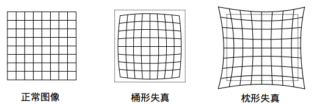

          

## 3. 校准标定
对于径向畸变，无论是桶形畸变还是枕形畸变，由于它们都是随着离中心的距离增加
而增加。我们可以用一个多项式函数来描述畸变前后的坐标变化：这类畸变可以用和距中
心距离有关的二次及高次多项式函数进行纠正：

$$x_{distorted} = x(1 + k_{1}r^{2} + k_{2}r^{4} + k_{3}r^{6})$$

$$y_{distorted} = y(1 + k_{1}r^{2} + k_{2}r^{4} + k_{3}r^{6})$$

因此，对于坐标处的未失真像素点 (x,y)，其在失真图像上的位置将为$(x_{distorted}, y_{distorted})$。径向变形的存在表现为“barrel”或“fish-eye”效应的形式。

由于摄像镜头不完全平行于成像平面，因此会发生切向畸变。对于切向畸变，可以使用另外的两个参数 p1; p2 来进行纠正:：

$$x_{distorted} = x + [2p_{1}xy + p_{2}(r^{2} + 2x^{2})]$$

$$y_{distorted} = y + [p_{1}(r^{2} + 2y^{2}) + 2p_{2}xy]$$

所以我们有五个失真参数，它们在OpenCV中呈现为具有5列的一行矩阵：

$distortion_coefficient = (k_{1}, k_{2}, p_{1}, p_{2}, k_{3})$

现在对于单位转换，我们使用以下公式：

$$
\left[\begin{matrix}
u \\
v \\
w
\end{matrix} \right] = 
\left[ \begin{matrix}
f_{x} & 0 & c_{x} \\
0 & f_{y} & c_{y} \\
0 & 0 & 1
\end{matrix} \right]  
\left[ \begin{matrix}
X \\
Y \\
Z
\end{matrix} \right]$$

这里通过使用单应性坐标系（w = Z）来解释w的存在。未知参数是fx和fy（摄像机焦距）和（cx，cy），它们是以像素坐标表示的光学中心。如果对于两个轴，使用给定的a纵横比（通常为1）的公共焦距，则fy=fx∗a a，并且在上面的公式中，我们将具有单个焦距f。包含这四个参数的矩阵称为相机矩阵。虽然失真系数是相同的，无论使用的相机分辨率，这些应该与校准分辨率的当前分辨率一起缩放。

确定这两个矩阵的过程是校准。这些参数的计算是通过基本几何方程来完成的。所使用的方程取决于所选择的校准对象。目前OpenCV支持三种校准对象类型：

- 古典黑白棋盘
- 对称圆形图案
- 不对称圆形图案

基本上，您需要使用相机拍摄这些图案的快照，并让OpenCV找到它们。每个发现的模式产生一个新的方程。要解决方程式，您需要至少预定数量的模式快照来形成一个精心设计的方程式。这个数字对于棋盘图案更高，而对于圆形图案则更小。例如，理论上棋盘图案至少需要两个快照。然而，实际上我们的输入图像中存在大量的噪音，所以为了获得良好的效果，您可能需要至少10个不同位置的输入图形快照。
## 4. Ros与opencv校准工具

4.1 opencv校准
在opencv中我们使用类似国际象棋板的黑白方格确定相机的畸变参数， 标定和正畸变。
 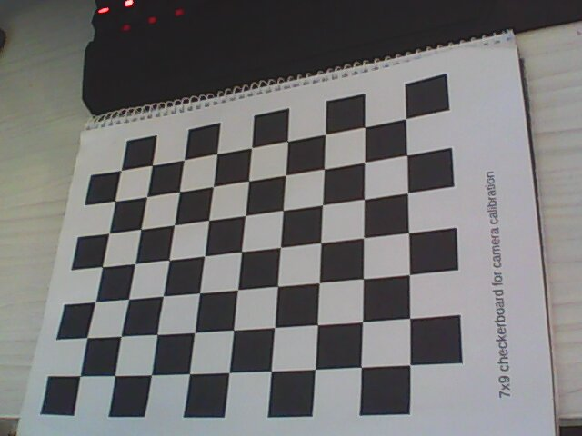
 
- 1 设置
 要在棋盘中找到相应的样式，我们使用函数cv2.findChessboardCorners（）。我们还需要给定我们正在寻找的样式的参数，如8x8网格，5x5网格等。在此示例中，我们使用7x6网格作为样式。 （通常棋盘有8x8方格和7x7内角）。它返回角点和一个返回值，如果函数获得pattern，它将返回True。这些角落将按顺序放置（从左到右，从上到下） 

        import numpy as np
        import cv2
        import glob

        # termination criteria
        criteria = (cv2.TERM_CRITERIA_EPS + cv2.TERM_CRITERIA_MAX_ITER, 30, 0.001)

        # prepare object points, like (0,0,0), (1,0,0), (2,0,0) ....,(6,5,0)
        objp = np.zeros((6*7,3), np.float32)
        objp[:,:2] = np.mgrid[0:7,0:6].T.reshape(-1,2)

        # Arrays to store object points and image points from all the images.
        objpoints = [] # 3d point in real world space
        imgpoints = [] # 2d points in image plane.

        images = glob.glob('*.jpg')

        for fname in images:
            img = cv2.imread(fname)
            gray = cv2.cvtColor(img,cv2.COLOR_BGR2GRAY)

            # Find the chess board corners
            ret, corners = cv2.findChessboardCorners(gray, (7,6),None)

            # If found, add object points, image points (after refining them)
            if ret == True:
                objpoints.append(objp)

                cv2.cornerSubPix(gray,corners,(11,11),(-1,-1),criteria)
                imgpoints.append(corners)

                # Draw and display the corners
                cv2.drawChessboardCorners(img, (7,6), corners2,ret)
                cv2.imshow('img',img)
                cv2.waitKey(500)

        cv2.destroyAllWindows()

- 2 标定参数
所以现在我们有了我们准备进行校准的对象点和图像点。为此，我们使用函数cv2.calibrateCamera（）。它返回相机矩阵，失真系数，旋转和平移向量等。

         ret, mtx, dist, rvecs, tvecs = cv2.calibrateCamera(objpoints, imgpoints, gray.shape[::-1],None,None)

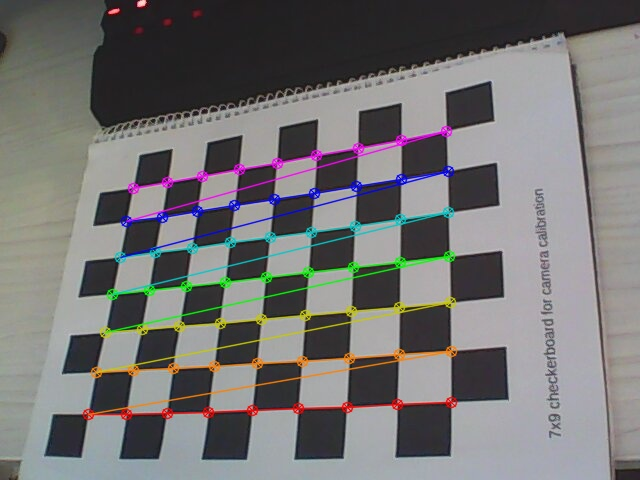

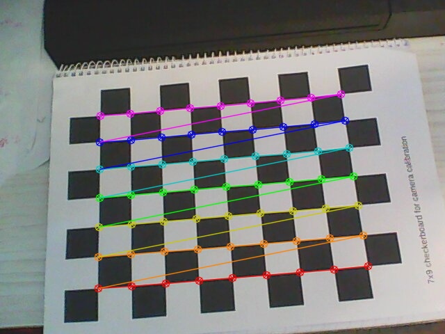

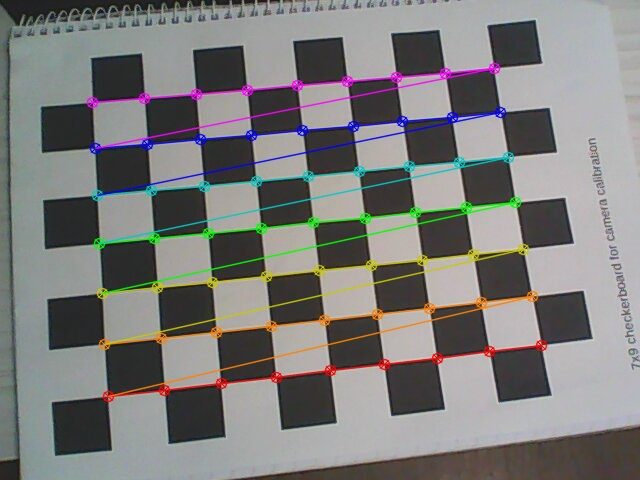

- 3 去畸变
我们得到了我们正在尝试的东西。现在我们可以拍摄一张照片并且不会失真。 OpenCV有两种方法，我们将看到两种方法。但在此之前，我们可以使用cv2.getOptimalNewCameraMatrix（）根据自由缩放参数优化相机矩阵。如果缩放参数alpha = 0，则返回带有最少不需要像素的未失真图像。因此它甚至可以删除图像角落处的一些像素。如果alpha = 1，则所有像素都会保留一些额外的黑色图像。它还返回一个图像ROI，可用于裁剪结果。所以我们拍了一张新照片（在这种情况下是4.jpg。这是本章的第一张图片）

**原图**

- 
- 4 结果
 
 **结果图**
 
 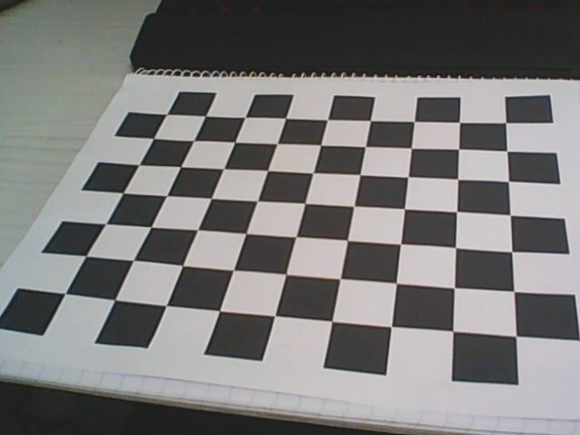

 - 5 反投影误差

  通过反投影误差，我们可以来评估结果的好坏。越接近0，说明结果越理想。通过之前计算的内参数矩阵、畸变系数、旋转矩阵和平移向量，使用cv2.projectPoints()计算三维点到二维图像的投影，然后计算反投影得到的点与图像上检测到的点的误差，最后计算一个对于所有标定图像的平均误差，这个值就是反投影误差。

## 4.2 ros校准工具
package

camera_calibration

<video width="320" height="240" controls>
  <source src="/video/1.mp4" type="video/mp4">
</video>

ROS官方提供了用于单目或者双目标定的camera_calibration包。 在单目相机中， 这个包接收image和image_info topic. 在本教程中， 我们使用uvc_cam包读入并发布图像消息，但是图像没有被标定，因此存在畸变。这个包是使用opencv里的张正友标定法，所以如果你有使用opencv标定的经验，可以直接标定，而不使用官方的程序。

1. 安装
   suduo apt-get install ros-indigo-uvc-cam
   sudo apt-get install ros-indigo-camera-calibration
   sudo apt-get install ros-indigo-image-view

2. 打开摄像头读取图像
   
- 打开master

        roscore
- 开启摄像头
  
        rosrun uvc_camera uvc_camera_node

    检查usb_cam package发布的消息：

        $ rostopic list
    
    看是否有如下消息，并记住名称

        /camera_info
        /image_raw

- 查看相机图片

        rosrun image_view image_view image:=/image_raw

1. 启动标定程序：

        $ rosrun camera_calibration cameracalibrator.py --size 9x7 --square 0.03 image:=/image_raw camera:=/

其中参数size 9x7 注意是字母x，他是棋盘内部角点个数，如下图所示。square为棋盘正方形边长，注意刚刚开始标定的时候，CALIBRATE按钮是灰色的。

                         

1. 标定程序使用方法：

为了得到一个好的标定结果，应该使得标定板尽量出现在摄像头视野的各个位置里：

如标定板出现在视野中的左边，右边，上边和下边，标定板既有倾斜的，也有水平的。

界面中的x：表示标定板在视野中的左右位置。

y：表示标定板在视野中的上下位置。

size：标定板在占视野的尺寸大小，也可以理解为标定板离摄像头的远近。

skew：标定板在视野中的倾斜位置。

并还要有棋盘占住大部分视野的图片，如下图所示：
 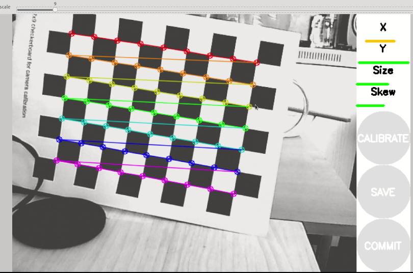

按着上述方式不断移动标定板，直到CALIBRATE按钮变亮，点击该按钮就会进行标定。标定过程将持续一两分钟，并且标定界面会变成灰色，无法进行操作，耐心等待即可。

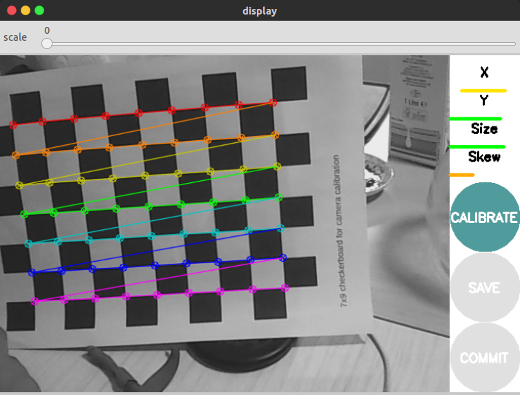

点击calibrate进行标定， 标定通常需要10-20秒。
标定完成以后，你将看到如下图所示的窗口，窗口中的图像为标定后的结果，纠正了畸变。

并且，摄像机的各个参数会出现在标定程序的终端窗口中，如下:

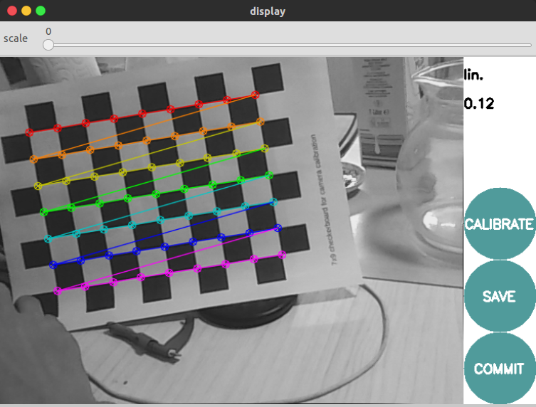    

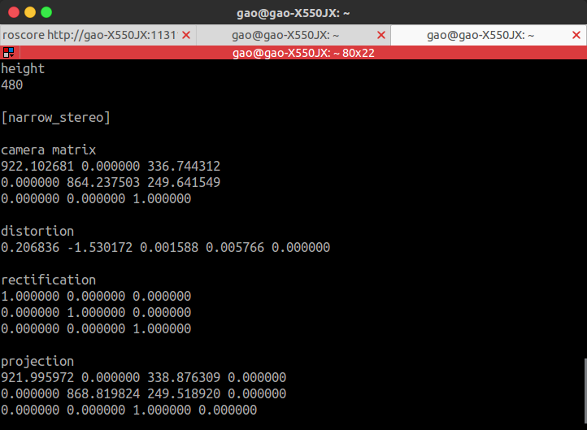   

如果对标定结果满意，点击COMMIT按钮将结果保存到默认文件夹，在usb_cam窗口中可以看到如下信息，说明标定结果已经保存在相应文件夹下下次启动usb_cam节点时，会自动调用。

 